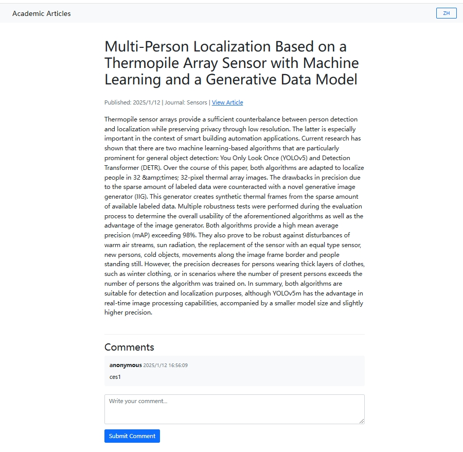

# YOUR Academic  News 

这是一个自动抓取和展示GIS相关学术期刊最新文章的系统。系统会定期从设定的RSS源获取最新文章，并提供中英文双语展示。


## 功能特点

- 自动抓取多个GIS相关期刊的RSS feed
- 文章标题和摘要的中英文双语显示
- 支持文章评论功能
- 响应式网页设计，支持移动端访问
- 支持DOI链接直达原文
- 支持RSS源的添加和删除

## 技术栈

- 后端：Express.js + Node.js
- 数据库：PostgreSQL
- RSS抓取：Python
- 前端：EJS
- 翻译：OpenAI API


## 前置准备

### 数据库配置
1. 创建数据库用户和设置密码（我用的postgress，你可以选择其他的，只是测试的话，可以用：https://sealos.run/   快速搭建数据库）


2. 测试数据库连接
```bash
python test_db2.py
```

3. 创建数据表
```bash
python init_db.py
```

### 依赖安装
安装 Node.js 依赖
```bash
npm install
```

安装 Python 依赖（仅本地数据库需要）
```bash
pip install -r requirements.txt
```

## 启动服务
启动 Express 服务器
```bash
node app.js
```

2. 启动 RSS 抓取脚本
```bash
# 抓取RSS
python rss_scheduler.py
# 翻译文章
python translate_articles.py 
```

## 项目结构
```
.
├── app.js           # Express服务器入口
├── routes/          # 路由文件
├── views/           # EJS模板
├── public/          # 静态文件
├── db.js           # 数据库配置
├── rss_scheduler.py # RSS抓取脚本
├── init_db.py      # 数据库初始化脚本
├── rss_parser.py   # RSS解析脚本
├── translate_articles.py # 文章翻译脚本
├── rss.txt         # RSS源
└── requirements.txt # Python依赖
```

## RSS 源
项目当前配置的 RSS 源（需要自己添加）：
- https://www.mdpi.com/rss/journal/remotesensing
- https://www.mdpi.com/rss/journal/sensors
- https://www.mdpi.com/rss/journal/ijgi

